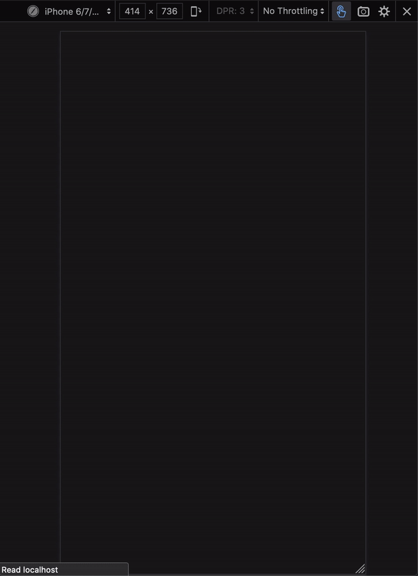
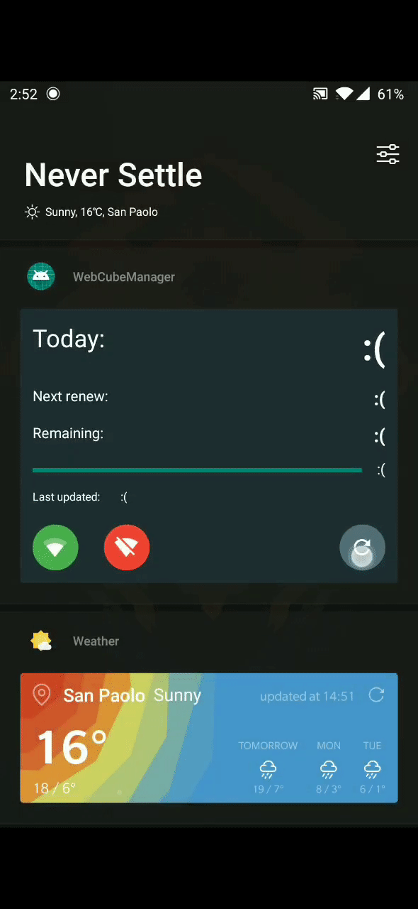

# Internet thresholds checker

## Context

During the years at the University in Turin my only internet access was a router
with a mobile metered connection. I had 30 Gb each month (I then switched to
100 Gb / month).
\
Since the internet consumption was not linear, It was easy to exceed the monthly
threshold without noticing. Hence I frequently had to pay more than the planned
amount.

The obvious solution would have been to upgrade to an unlimited connection, but
I was learning to program, so I opted for the funnier solution ... that is this
project.

## Structure

This project is composed by 3 main sub-projects:
1. A set of APIs written using [Flask](https://flask.palletsprojects.com/en/1.1.x/)
    and a background scheduler to get stats and to periodically check if those
    stats are below a certain threshold
2. A [React](https://reactjs.org/) website to get stats directly from the browser
3. An Android application/widget written in Kotlin to get stats and interact with
    the mobile router directly from the smartphone's homescreen

<br>

### 1 - Flask APIs
The APIs available are:
- `/status` get the current status
- `/weekly_readings` get a list of all statuses during the current week

Example of a response from _/status_
```json
{
  "status": {
    "reading": {
      "total_gb": 7.5,
      "remaining_gb": 6.5,
      "date": "2021-12-05T17:04:35.814523"
    },
    "connected": true,
    "traffic_exceeded": false
  },
  "details": {
    "percentage": 86.66666666666667,
    "days_to_renew": 7,
    "actual_remaining_gb": 6.125,
    "mean_daily_left_gb": 1.0208333333333333,
    "actual_daily_left_gb": 0.7249999999999996
  }
}
```

The underlain login behind _/status_ get called every 20 minutes by a background
scheduler. That logic automatically switch on/off the router based on a daily
threshold (more or less `monthly total / 30`) and on a fixed threshold (300 Mb
to the paying threshold).

<br>

### 2 - React website
Just a simple React website with the APIs information displayed
<p align="center">
  
</p>

<br>

### 3 - Android application and widget
With the Android widget it's possible to gather the same information of points
__1__ and __2__, but directly from the smartphone's homescreen. This has been the
most useful part of the project 🤓.
\
With the green and red buttons it's possible to turn on/off the internet from the
router.

<p align="center">
  
</p>

<br>

## Docker
The Flask APIs and the React website can be launched easily using docker and
docker compose with the command:
\
`$ docker-compose up`
